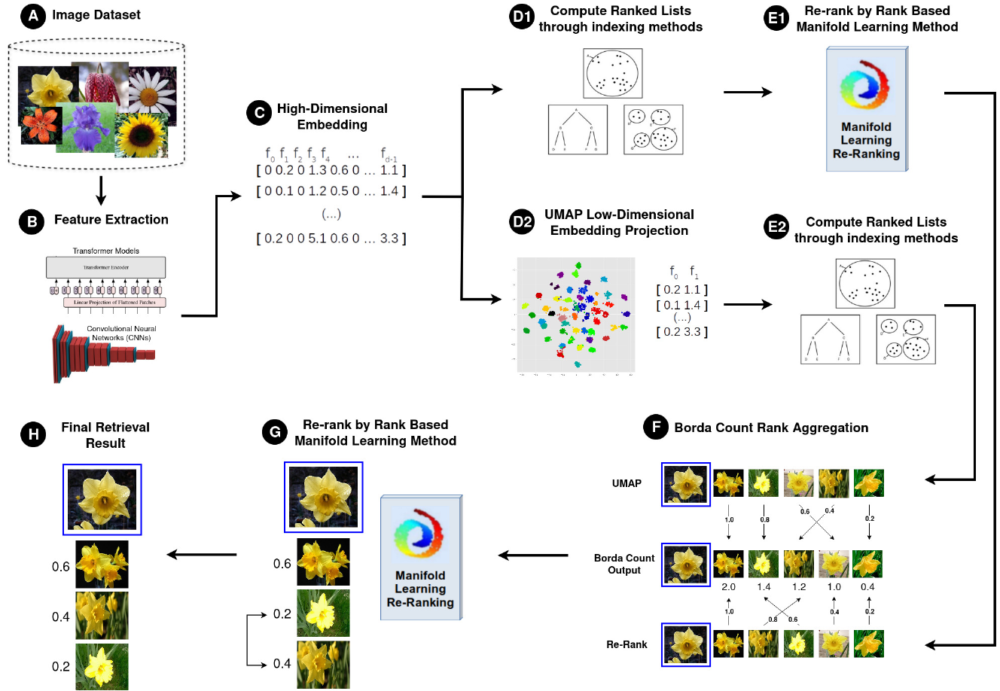

# Manifold-Rank-Fusion

Source code for **"Aggregating Neighbor Embedding Projection and Rank-Based
Manifold Learning for Image Retrieval"** (Journal of the Brazilian Computer
Society, JBCS).

The framework combines two complementary strategies for content-based image
retrieval:

- **Neighbor embedding projection**: UMAP is used to project deep features
  into a low-dimensional space, generating an alternative ranked list per
  query.
- **Rank-based manifold learning**: LHRR, CPRR, or RFE re-rank the original
  feature-space ranked lists using contextual/manifold information, through
  [pyUDLF](https://github.com/UDLF/pyUDLF).

The two resulting rankings are then combined with **Borda Count** rank
aggregation, optionally followed by an additional re-ranking pass for
further refinement. Reciprocal Rank Fusion (RRF) and CombSUM are also
provided as alternative aggregation baselines, used for comparison in the
paper.

## Pipeline overview



Steps A-B (image dataset, feature extraction) are out of scope for this
repository -- the example scripts start from pre-extracted `.npy` features.
The rest maps directly onto them: `01_generate_ranking.py` covers D1/D2
(ranked lists from the original embedding and from the UMAP projection),
`02_rerank_with_pyudlf.py` covers E1 (LHRR/CPRR/RFE re-ranking),
`03_aggregate_rankings.py` covers F (Borda Count / RRF / CombSUM
aggregation), and `04_post_rerank_and_evaluate.py` covers G-H (post
re-rank and the final retrieval result). Each intermediate stage can also
be evaluated on its own, as done in the ablation-style comparison in
`examples/notebook_example.ipynb`.

## Repository layout

```
src/manifold_rank_fusion/
    projection.py     UMAP projection + Ball Tree ranked-list generation
    udlf_rerank.py     pyUDLF wrapper for LHRR/CPRR/RFE re-ranking + evaluation
    aggregation.py     Borda Count, RRF, and CombSUM rank aggregation
    io_utils.py        Ranked-list / classes file I/O helpers (pure Python)

examples/
    01_generate_ranking.py            Feature loading + (optional UMAP) ranking
    02_rerank_with_pyudlf.py          Rank-based manifold learning (LHRR/CPRR/RFE)
    03_aggregate_rankings.py          Borda Count / RRF / CombSUM aggregation
    04_post_rerank_and_evaluate.py    Post re-rank + effectiveness evaluation
    05_compare_aggregation_methods.py Side-by-side Borda vs. RRF vs. CombSUM

tests/
    test_aggregation.py    Unit tests for the aggregation formulas

config/
    config.ini.template    Reference UDLF config (the scripts build this
                            programmatically; the file is for reference)

data/corel5k/
    A ready-to-use sample (Corel5k dataset, Swin Transformer features) so
    the usage examples below run right after cloning -- see "Bundled
    sample data".
```

## Installation

Requires Python >= 3.9.

```bash
python -m venv .venv
source .venv/bin/activate
pip install -r requirements.txt
pip install -e .
```

**pyUDLF is not published on PyPI.** Install it from source:

```bash
git clone https://github.com/UDLF/pyUDLF.git
cd pyUDLF
pip install -e .
```

pyUDLF manages its own UDLF binary under `~/.pyudlf` by default. If you have
a local UDLF build instead, point pyUDLF at it with
`manifold_rank_fusion.udlf_rerank.configure_udlf(binary_path=..., config_path=...)`.

pyUDLF is only needed for re-ranking (`udlf_rerank.py`, example scripts 02,
04, 05) and MAP/Precision/Recall evaluation. Generating rankings
(`projection.py`) and aggregating them (`aggregation.py`, example scripts
01, 03) only need `numpy`/`scikit-learn`/`umap-learn`.

## Bundled sample data

`data/corel5k/` ships a ready-to-use sample -- the Corel5k dataset (5,000
images, 50 classes) with pre-extracted Swin Transformer features -- so the
usage examples below run immediately after cloning, with no dataset
download or feature extraction needed:

```
data/corel5k/
    features_swintf_corel5k.npy    # (5000, n_dims) pre-extracted features
    corel5k_lists.txt               # one item filename per line
    corel5k_classes.txt             # "<item filename>:<class id>" per line
    corel5k_swintf.txt              # precomputed original-feature ranking
    corel5k_swintf_umap.txt         # precomputed UMAP-projection ranking
    corel5k_swintf_CPRR.txt         # precomputed CPRR re-ranking
```

The three precomputed ranked-list files let you try aggregation (and, if
pyUDLF is installed, post re-ranking and evaluation) without first running
the earlier pipeline stages yourself; they're also the reference outputs
of the `01`/`02` example commands below, useful for checking
reproducibility.

For your own data, the same layout applies -- pre-extracted deep features
(feature extraction itself is out of scope for this repository) plus
UDLF's dataset metadata files:

```
data/<dataset>/
    features_<descriptor>_<dataset>.npy   # (n_items, n_dims) float array
    <dataset>_lists.txt                    # one item filename per line
    <dataset>_classes.txt                  # "<item filename>:<class id>" per line
```

Ranked-list files (both inputs and outputs of the pipeline) follow UDLF's
plain-text format: one line per query, whitespace-separated item ids
ordered from most to least relevant.

## Usage

Quick start -- generate a ranking and aggregate it, no pyUDLF needed:

```bash
python examples/01_generate_ranking.py \
    --features data/corel5k/features_swintf_corel5k.npy \
    --output output/corel5k_swintf_umap.txt \
    --umap

python examples/03_aggregate_rankings.py \
    --umap-ranking output/corel5k_swintf_umap.txt \
    --rerank-ranking data/corel5k/corel5k_swintf_CPRR.txt \
    --output output/borda_corel5k_swintf_CPRR.txt
```

For the full pipeline (re-ranking, post re-rank, evaluation, and comparing
Borda Count against RRF/CombSUM), see **[examples/README.md](examples/README.md)**
for the complete command reference, or **[examples/notebook_example.ipynb](examples/notebook_example.ipynb)**
for a narrated, section-by-section notebook walkthrough.

## Rank aggregation formulas

Given ranked lists to combine, each item's aggregated score is:

| Method    | Score contribution per list                          | Notes                                   |
|-----------|--------------------------------------------------------|------------------------------------------|
| Borda Count | `N - r - 1`, `r` = 0-indexed rank, `N` = list size | Adopted by the proposed framework         |
| RRF       | `1 / (k + r)`, `r` = 1-indexed rank, `k = 60`          | Cormack et al., 2009                     |
| CombSUM   | `1 / (r + 1)`, `r` = 0-indexed rank                    | Positional-score transformation (Sec. 4.4); LHRR/CPRR/RFE outputs don't expose normalizable distances |

Contributions are summed across all input lists and items are ranked by
descending total score. All three are implemented in
`src/manifold_rank_fusion/aggregation.py` and covered by
`tests/test_aggregation.py`.

## UMAP hyperparameters

Defaults follow Section 4.2 of the paper (umap-learn library defaults, with
a fixed random seed for reproducibility):

```python
n_components = 2
n_neighbors  = 15
min_dist     = 0.1
metric       = "euclidean"
random_state = 42
```

`K` for LHRR/CPRR/RFE is adjusted per dataset size (`L = 1000`, `T = 2` are
kept fixed): Flowers = 80, Corel5k/Pets = 100, CUB200/Dogs = 120. See
`DATASET_K` in `src/manifold_rank_fusion/udlf_rerank.py`.

## Tests

```bash
python -m unittest discover -s tests -v
```

## Citation

```bibtex
@article{kawai2026manifold,
  title   = {Aggregating Neighbor Embedding Projection and Rank-Based Manifold Learning for Image Retrieval},
  author  = {Kawai, Vinicius Atsushi Sato and Leticio, Gustavo Rosseto and Valem, Lucas Pascotti and Pedronette, Daniel Carlos Guimar{\~a}es},
  journal = {Journal of the Brazilian Computer Society},
  year    = {2026}
}
```

## Contacts

- **Vinicius Atsushi Sato Kawai** — São Paulo State University (UNESP), Rio Claro, Brazil — vinicius.kawai@unesp.br
- **Gustavo Rosseto Leticio** — São Paulo State University (UNESP), Rio Claro, Brazil — gustavo.leticio@unesp.br
- **Lucas Pascotti Valem** — University of São Paulo (USP), São Carlos, Brazil — lucas@icmc.usp.br
- **Daniel Carlos Guimarães Pedronette** — São Paulo State University (UNESP), Rio Claro, Brazil — daniel.pedronette@unesp.br
